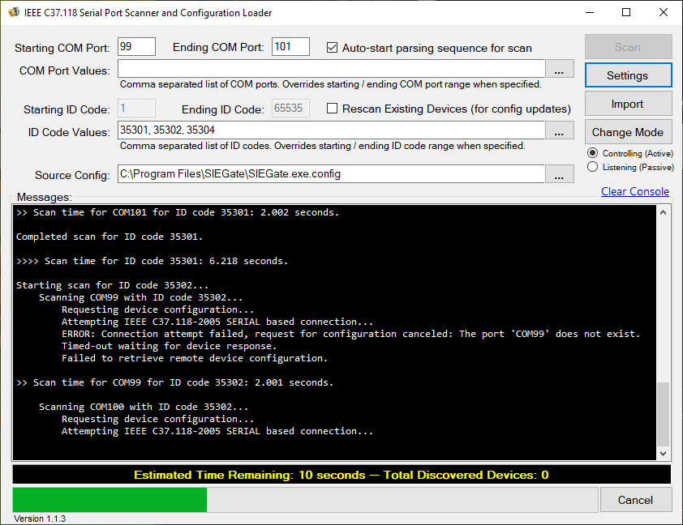
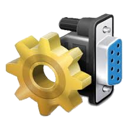

[](https://gridprotectionalliance.github.io/PortScanner/)

IEEE C37.118 Serial Port Scanner and Configuration Loader.



## Usage with Command Line Parameters
```shell
PortScanner [options]
```

### Options

| Short | Long | Description |
|:-----:| ---- | ----------- |
| &#x2011;b | &#x2011;&#x2011;BaudRate | Defines the serial baud rate. Standard values: 110, 300, 600, 1200, 2400, 4800, 9600, 14400, 19200, 38400, 57600, 115200, 128000, or 256000. |
| &#x2011;d | &#x2011;&#x2011;DataBits | Defines the standard length of data bits per byte. Standard values: 5, 6, 7 or 8. |
| &#x2011;p | &#x2011;&#x2011;Parity | Defines the parity-checking protocol. Value is one of: Even, Mark, None, Odd or Space. |
| &#x2011;s | &#x2011;&#x2011;StopBits | Defines the standard number of stopbits per byte. Value is one of: None, One, OnePointFive or Two. |
| &#x2011;t | &#x2011;&#x2011;DtrEnable | Defines boolean value, true or false, that enables the Data Terminal Ready (DTR) signal during serial communication. |
| &#x2011;r | &#x2011;&#x2011;RtsEnable | Defines boolean value, true or false, indicating whether the Request to Send (RTS) signal is enabled during serial communication. |

## Example
* Scan serial ports using 9600 baud:
```shell
PortScanner -b=9600
```

## Default Settings File
Default settings for optional parameters, e.g., serial baud rate and parity, are configured in a `settings.ini` file. This file will be automatically created when the application is first run. The location for this configuration file is `C:\ProgramData\AutoConfigPortScanner\settings.ini`.

The original default values are initially commented out. Following is an example of the default settings file with an override:

```ini
[Serial]
; Defines the serial baud rate. Standard values: 110, 300, 600, 1200, 2400,
; 4800, 9600, 14400, 19200, 38400, 57600, 115200, 128000, or 256000.
;BaudRate=115200
BaudRate=9600

; Defines the standard length of data bits per byte. Standard values: 5, 6,
; 7 or 8.
;DataBits=8

; Defines the parity-checking protocol. Value is one of: Even, Mark, None, Odd
; or Space.
;Parity=None

; Defines the standard number of stopbits per byte. Value is one of: None, One,
; OnePointFive or Two.
;StopBits=One

; Defines the value that enables the Data Terminal Ready (DTR) signal during
; serial communication.
;DtrEnable=False

; Defines the value indicating whether the Request to Send (RTS) signal is
; enabled during serial communication.
;RtsEnable=False
```

